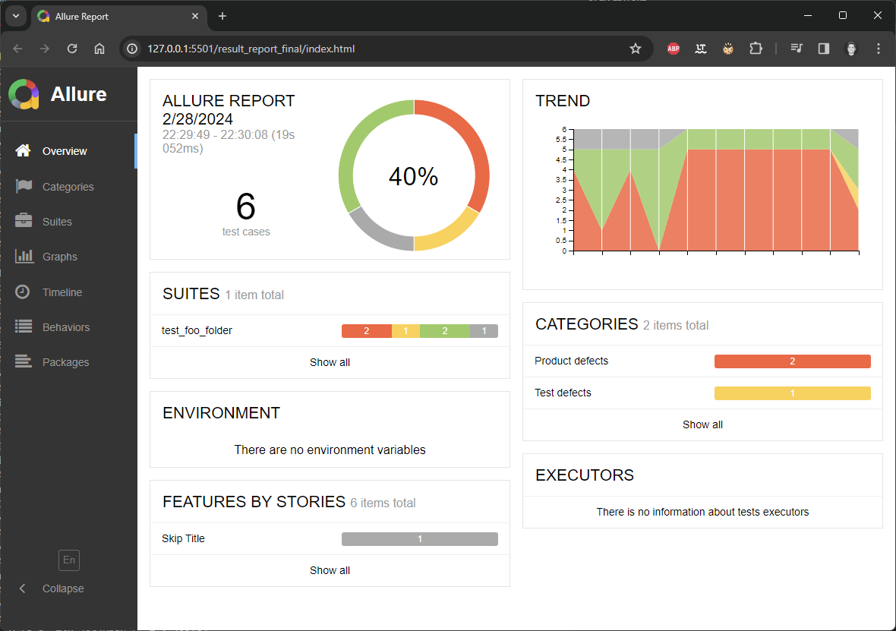

# Testing an Reporting in Python: Allure, Pytest, and Conda

This is a simple example of how to use Allure, Pytest, and Conda to create a test suite and generate a report.
The report is generated in a single file, which is useful for sharing the report with others. Also the history of the test runs is included in the report.

## Setup

- Install allure via Powershell-Command: ``scoop install allure`` *(get scoop from <https://scoop.sh/> if needed)*
- Create a new conda environment: ``conda create -n testerei python=3.12`` and activate it with ``conda activate testerei``
- Install allure and pytest via pip: ``pip install -r requirements.txt``
- Run the tests by executing the Powershell-Script ``.\run_tests_and_create_report.ps1`` from within the activated conda environment. When you are in CMD, use ``powershell -File "run_tests_and_create_report.ps1"`` to do so.

## Report preview

## Author / License

The unlicense applies to the code in this repository. The author of this repository is:

**Henning 'haenno' Beier, 2024, <haenno@web.de>**
